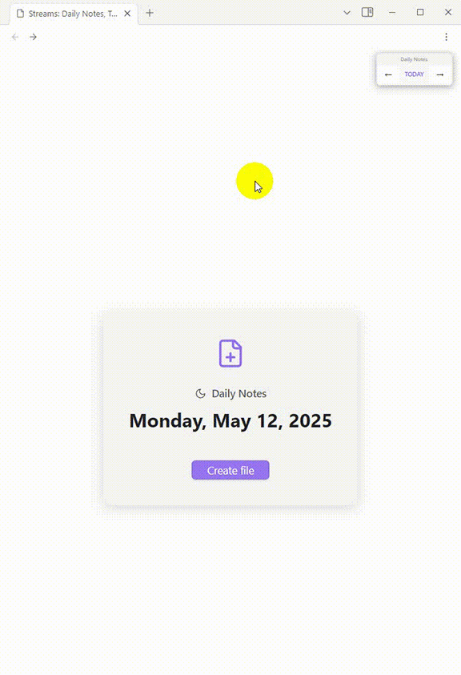

# Coalesce

Coalesce your backlinked notes into a single view.

## Description:

Inspired by Roam, Logseq, Influx, OneNote's Quick Notes, and Obsidian's "Backlinks in document" feature.

This plugin addresses the challenge of organizing quick notes when immediate sorting into folder hierarchies is not feasible, such as during busy or stressful moments. It enables users to efficiently capture notes within a daily note stream and add backlinks at a later, more convenient time. Importantly, it ensures that these quick notes remain accessible, comprehensive, and easy to locate.

## Features
- Replace Obsidian's Backlinks in Document with a more comprehensive and configurable view.
- Use aliases to further narrow the view.

## Getting Started
1. Enable daily notes, or even better, use the Streams Plugin.
2. Take notes in a daily note.
3. Add a backlink above your text block.
4. Add a --- linebreak below the text block.
5. Navigate to the backlinked file.
6. Enter view mode.

