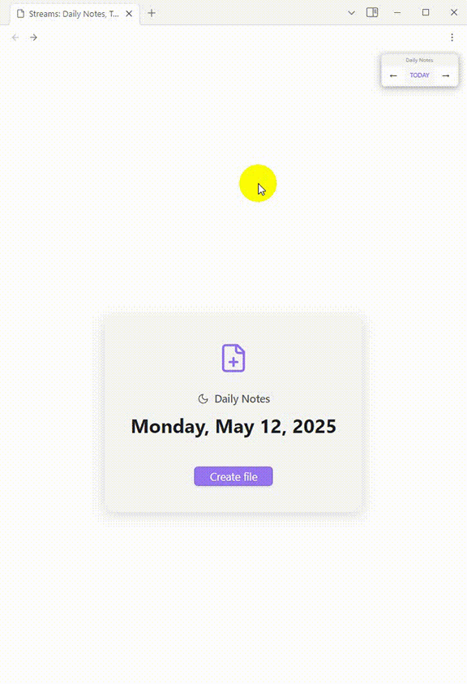

# Coalesce

Coalesce your notes into a single view.

## Description:

Inspired by Roam, Logseq, Influx, OneNote's Quick Notes, and Obsidian's "Backlinks in document" feature.

This plugin addresses:
1. The challenge of taking quick notes when immediate sorting into folder hierarchies is not quick enough.
2. Later finding and viewing those notes in a single view.

## Features
- Replace Obsidian's Backlinks in Document with a more comprehensive and configurable view.
- Use aliases and filtering to further narrow the view.

## Getting Started
1. Enable daily notes.
2. Add a backlink followed by text.
3. Navigate to the backlinked file.
4. Enter view mode and view your note.
5. To limit how far down the view goes, separate with a divider (---).

